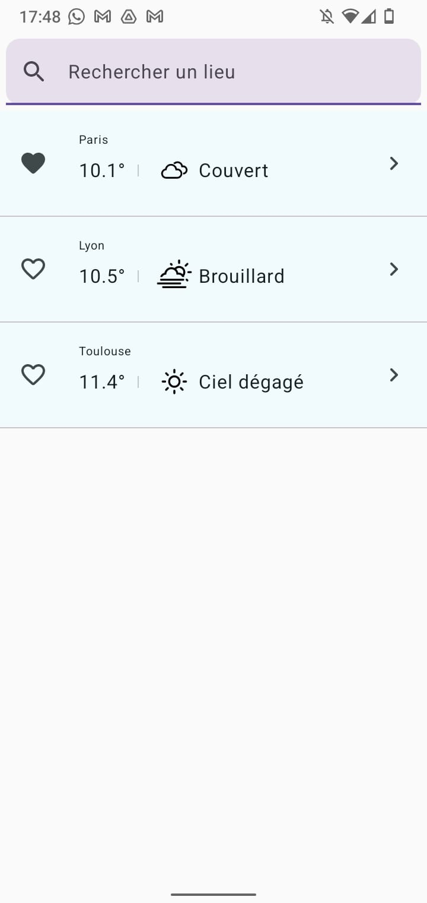
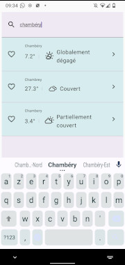

# Weather App - Prototype
## Présentation
> Ce projet est en développement

Ce projet est un prototype d'une application météo simple.
Développé pour Android en Kotlin avec Jetpack Compose.

A ce stade, les données météorologiques sont chargées depuis l'API pour chacune des villes dont les coordonnées sont renseignées dans *model/LocationRepository*.
A terme, l'utilisateur aura la possibilité de rechercher une ville et de l'ajouter aux favoris (qui seront enregistrés).

## Captures d'écran

## Fonctionnalités
### 🖼️ UI
* Compose UI
* Material Design

### 🏠 Architecture
* Jetpack Compose UI
* Architecture MVVM
* Connexion à l'API OpenMeteo (Retrofit + Serialization)
* Sauvegarde locale utilisant les SharedPreferences

## API
Pour ce prototype, nous avons choisi d'utiliser l'[API OpenMeteo](https://open-meteo.com/en/docs#hourly=temperature_2m,weather_code).
Cette API présente en effet l'avantage de ne pas nécessiter d'authentification, et de présenter les résultats simplement sous format JSON.
Pour gérer les lieux, nous avons choisi d'utiliser l'[API Geocoding](https://open-meteo.com/en/docs/geocoding-api).

## Crédits
Les icônes météo proviennent du [travail de Lukas Bischoff](https://github.com/erikflowers/weather-icons), sous licence [SIL OFL 1.1](http://scripts.sil.org/OFL).

## TODO
- [x] Connecter SearchBar à l'API Geocoding
- [x] Enregistrer les localisations favorites sur le téléphone
- [ ] Afficher une vue vide quand on clique sur "plus de précisions" chaque localisation
- [ ] Changer icône (retirer fond bleu)
- [ ] Créer une meilleure UI
- [ ] Indicateur de progression dans le chargement des données / d'erreur le cas échéant
- [ ] Possibilité de recharger les données
- [ ] Créer la vue détaillée pour chaque localisation